개요
--------------------------
휴대용 현장운용단말기의 내장 소프트웨어.  
박스형태의 휴대용 단말기를 통해 사용중인 장치들로부터 수집된 값과 상태를 현장에서 즉각 확인할 수 있도록 하는데 주 목적이 있다.  

소프트웨어 프론트엔드 기능
-------------------------
1. 가스농도 데이터 관제 - 실시간 모니터링
  - 장치로부터 받은 데이터 표시
  - 장치상태(정상, 위험, 미수신) 표시
  - 정상 외의 상황시 알람
2. 가스 데이터 로그 조회
  - 테이블 형태
  - 그래프 형태
3. 이벤트(경고, 위험, 미수신등의 상태를 뜻함) 로그 조회
4. 로그저장기능 - 로그정보를 별도의 윈도우즈 폴더, USB에 저장할 수 있는 기능

서버 기능
---------------------------
1. 부저 펌웨어와 웹소켓 통신

개발스펙
--------------------------
- Frontend: React 17.0.1
- Backend: Spring boot 2.4.0
- Server: Apache Tomcat
- DB: MariaDB 
- JDK 11
- Display: 13인치 FHD

순서도
-------------------------

이슈
-------------------------
- 파일 다운로드 시 특정 가변적인 경로로 다운로드되도록 개발

